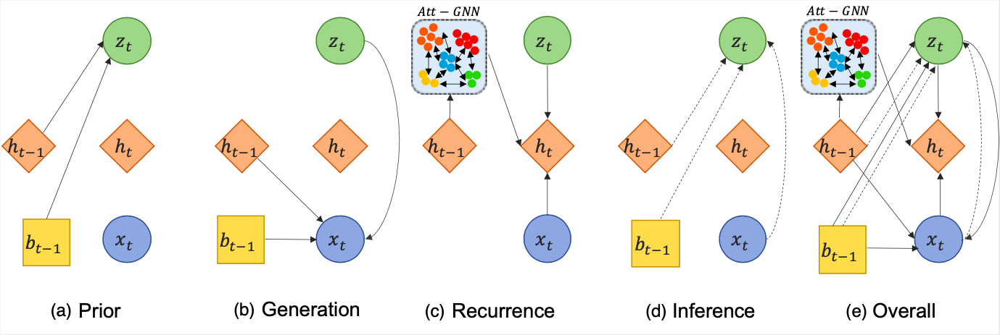

# AC-VRNN: Attentive Conditional-VRNN for Multi-Future Trajectory Prediction
This repository contains the PyTorch code for paper:

**<a href="https://arxiv.org/abs/2005.08307">AC-VRNN: Attentive Conditional-VRNN for Multi-Future Trajectory Prediction</a>**  
*<a href="https://aimagelab.ing.unimore.it/imagelab/person.asp?idpersona=110">Alessia Bertugli</a>,
<a href="https://aimagelab.ing.unimore.it/imagelab/person.asp?idpersona=38">Simone Calderara</a>,
<a href="https://sites.google.com/view/pasqualecoscia"> Pasquale Coscia</a>,
<a href="http://www.lambertoballan.net">Lamberto Ballan</a>,
<a href="https://aimagelab.ing.unimore.it/imagelab/person.asp?idpersona=1">Rita Cucchiara</a>*  

## Model architecture
AC-VRNN is new generative model for multi-future trajectory prediction based on Conditional Variational Recurrent Neural Networks (C-VRNNs). Conditioning relies on prior belief maps, representing most likely moving directions and forcing the model to consider the collective agents’ motion. Human interactions are modeled in a structured way with a graph attention mechanism, providing an online attentive hidden state refinement of the recurrent estimation.



## Prerequisites

* Python >= 3.8
* PyTorch >= 1.5
* CUDA 10.0


## Datasets

1. ETH/UCY DATSETS

A) SGAN/STAGT dataset version.

B) SR_LSTM version (only Biwi Eth annotations are changed).

C) Social Ways version --> to obtain the dataset take Social-Ways data and use dataset_processing/process_sways.py to process the data for this code.

2. SDD

Download *<a href="http://trajnet.stanford.edu"> TrajNet </a>* benchmark, take training data and use dataset_processing/split_sdd.py to process the data for this code.


## Belief Maps

To obtain belief maps for each dataset use dataset_processing/heatmap.py. Two stages are required:
1. Generate statistics to compute the coarse of the global grid.
   They are obtained calling compute_mean_displacement_[dataset_name] function.
2. Generate belief maps for each dataset calling compute_local_heatmaps_[dataset_name].

## Training the model
To train AC-VRNN use models/graph/train.py on ETH/UCY A and B giving it the correct paths. Set model='gat'.

To train AC-VRNN use models/graph/train_dsways.py on ETH/UCY C. Set model='gat'.

To train AC-VRNN use models/graph/train_sdd.py on SDD.

## Evaluating the model
To evaluate the model call utils/evaluate_model.py setting the correct paths, and load the dataset you want to test.

## Cite
If you have any questions,  please contact [alessia.bertugli@unitn.it](mailto:alessia.bertugli@unitn.it)  or [alessia.bertugli@unimore.it](mailto:alessia.bertugli@unimore.it), or open an issue on this repo. 

If you find this repository useful for your research, please cite the following paper:
```bibtex
@article{Bertugli2020ac-vrnn,
  title={AC-VRNN: Attentive Conditional-VRNN for Multi-Future Trajectory Prediction},
  author={Alessia Bertugli and Simone Calderara and Pasquale Coscia and Lamberto Ballan and Rita Cucchiara},
  journal={ArXiv},
  year={2020},
  volume={abs/2005.08307}
}
```
